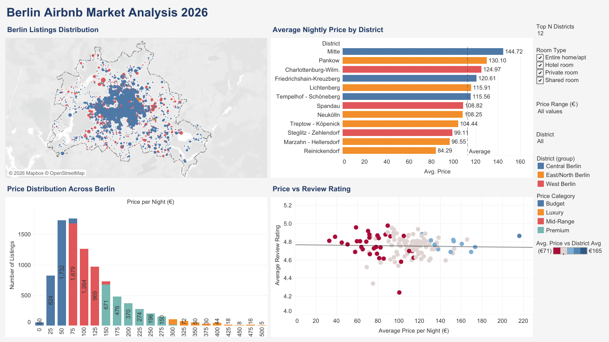
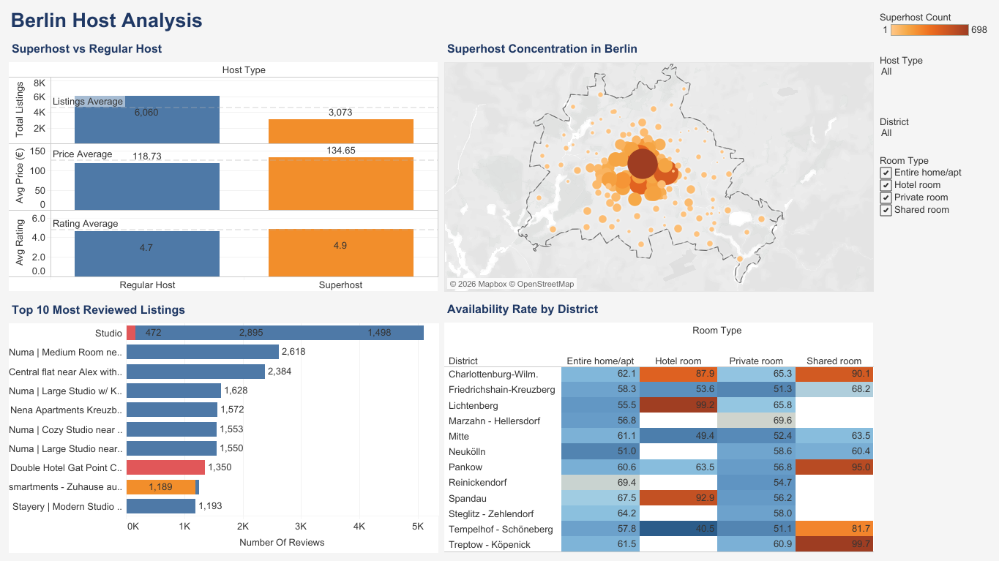
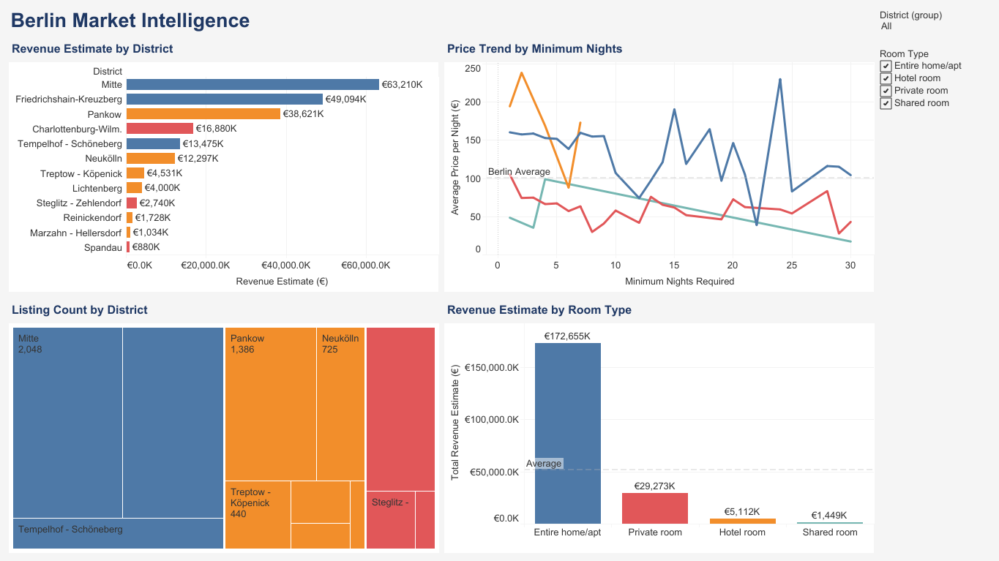

# Berlin Airbnb Market Analysis 2026

An interactive Tableau dashboard analyzing the Berlin Airbnb market using 
real 2026 data from InsideAirbnb. The project covers pricing, availability, 
host performance, and revenue insights across all 12 Berlin districts.

## 📊 Dashboards

### 1. Overview & Pricing

- Interactive map of 14,274 Berlin listings
- Average nightly price by district
- Price distribution across Berlin
- Price vs review rating by neighbourhood

### 2. Host Analysis

- Superhost vs Regular Host KPI comparison
- Superhost concentration map across Berlin
- Top 10 most reviewed listings
- Availability rate by district and room type

### 3. Market Intelligence

- Revenue estimate by district
- Price trend by minimum nights
- Listing count by district
- Revenue estimate by room type

## 🔍 Key Insights

- **Mitte** is the most expensive district at **€144.72** avg/night
- **Superhosts** charge **€134.65** vs **€118.73** for Regular Hosts
- **Superhosts** rate **4.9** vs **4.7** for Regular Hosts
- **Entire home/apt** dominates revenue at **€172,655K**
- Most listings cluster in the **€50–€100** price range
- **Central Berlin** has the highest Superhost concentration

## 🛠️ Tools Used

- **Tableau Desktop** — dashboard development
- **Data Source** — InsideAirbnb Berlin 2026
- **Dataset Size** — 14,274 listings, 79 fields

## 📁 Files

| File | Description |
|---|---|
| `Berlin_Airbnb_Dashboard.twbx` | Tableau packaged workbook |
| `Berlin Airbnb Analysis.png` | Overview & Pricing screenshot |
| `Berlin Host Analysis.png` | Host Analysis screenshot |
| `Berlin Market Intelligence.png` | Market Intelligence screenshot |

## 🚀 How to Open

1. Download `Berlin_Airbnb_Dashboard.twbx`
2. Open with **Tableau Desktop** or **Tableau Public**
3. Navigate between dashboards using the story navigation bar

## 📌 Data Source

Data provided by [InsideAirbnb](http://insideairbnb.com/get-the-data/)
— Berlin, Germany 2026

---
*Created as part of Tableau Lab course project — 
University of Bologna, May 2026*
